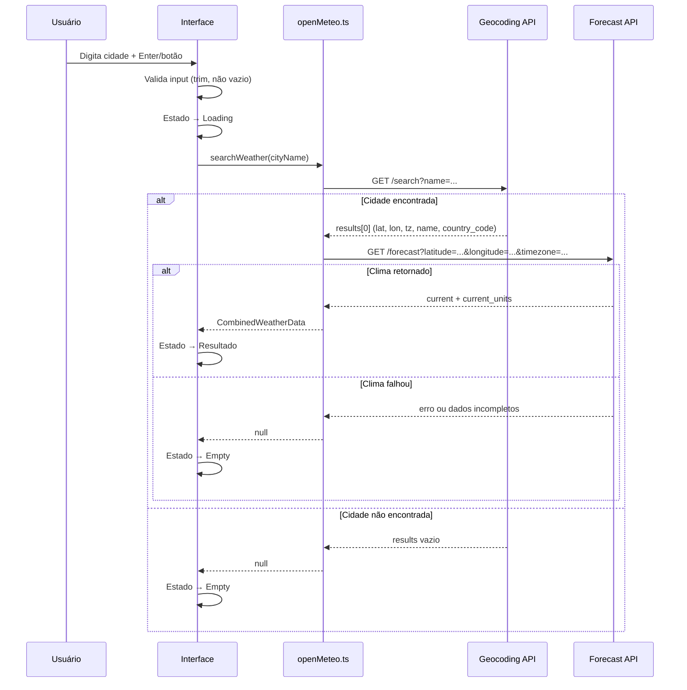

# PRD — Clima

**Versão:** 1.0  
**Data:** 17/06/2026  
**Status:** Aprovado para implementação

---

## 1. Visão geral

O **Clima** é uma aplicação web que permite ao usuário pesquisar uma cidade e visualizar as principais informações meteorológicas da região em tempo real. Os dados são obtidos via API pública [Open-Meteo](https://open-meteo.com/), sem necessidade de autenticação.

### Objetivo

Oferecer uma experiência simples e direta: o usuário digita o nome de uma cidade e recebe temperatura, umidade, vento, precipitação e condição do tempo atual.

### Público-alvo

Usuários que desejam consultar rapidamente o clima de qualquer cidade do mundo.

---

## 2. Aspectos funcionais

### 2.1 Fluxo principal

```
[Empty State] → Usuário digita cidade → [Loading] → [Resultado] ou [Empty State]
```

1. A aplicação inicia no **empty state** (nenhuma cidade pesquisada).
2. O usuário digita o nome de uma cidade no campo de busca.
3. O usuário dispara a busca via **tecla Enter** ou **clique no botão de busca**.
4. A interface exibe **loading** enquanto as requisições são processadas (geocoding + forecast em sequência).
5. Se ambas as requisições retornarem dados válidos, a interface exibe o **resultado** com os dados do clima.
6. Se a cidade não for encontrada **ou** os dados de clima falharem, a interface retorna ao **empty state** (mesmo comportamento visual — sem distinção de mensagem de erro).

### 2.2 Campo de busca

| Requisito | Descrição |
|-----------|-----------|
| Localização | Área superior centralizada, fora do card principal |
| Placeholder | Sugestão: "Digite o nome da cidade" |
| Disparo | Enter no campo **ou** clique no botão de busca |
| Validação | Se o campo estiver vazio, não dispara requisição |
| Trim | Remover espaços em branco no início e fim antes de buscar |

### 2.3 Estados da interface

| Estado | Condição | Comportamento |
|--------|----------|---------------|
| **Empty** | Inicial ou busca sem resultado | Card principal vazio ou com mensagem convidando à busca; sidebar e área principal sem dados |
| **Loading** | Busca em andamento | Indicador de carregamento visível; campo de busca desabilitado ou com feedback visual |
| **Resultado** | Geocoding + forecast com sucesso | Sidebar e área principal preenchidos com os dados |

> **Decisão:** Cidade não encontrada e falha no clima usam o **mesmo empty state**. Não há mensagens de erro diferenciadas para o usuário.

### 2.4 Dados exibidos

#### Sidebar (esquerda)

| Campo | Fonte | Formato de exibição |
|-------|-------|---------------------|
| Temperatura | `current.temperature_2m` + `current_units.temperature_2m` | Valor + unidade (ex: `19.3°C`) |
| Cidade e país | `name` + `country_code` | Ex: `Rio de Janeiro, BR` |
| Dia atual | `timezone` da cidade | Data formatada em português, no fuso horário da cidade (ex: `terça-feira, 17 de junho de 2026`) |
| Dia/Noite | `current.is_day` | Texto **"Dia"** ou **"Noite"** + ícone correspondente (sol/lua) |
| Condição do tempo | `current.weather_code` | Descrição textual em **português** (mapeamento WMO) |

#### Área principal (direita)

| Campo | Fonte | Formato de exibição |
|-------|-------|---------------------|
| Umidade relativa | `current.relative_humidity_2m` + unidade | Ex: `92%` |
| Temperatura aparente | `current.apparent_temperature` + unidade | Ex: `21.4°C` |
| Probabilidade de precipitação | `current.precipitation_probability` + unidade | Ex: `73%` |
| Vento | `wind_speed_10m` + `wind_direction_10m` | Velocidade + direção em graus e cardinal (ex: `5.8 km/h · 277° (O)`) |

### 2.5 Mapeamento Weather Code (WMO → Português)

| Código(s) | Descrição (PT) |
|-----------|----------------|
| 0 | Céu limpo |
| 1, 2, 3 | Predominantemente limpo, parcialmente nublado e nublado |
| 45, 48 | Neblina e neblina com geada |
| 51, 53, 55 | Garoa: leve, moderada e intensa |
| 56, 57 | Garoa congelante: leve e intensa |
| 61, 63, 65 | Chuva: leve, moderada e forte |
| 66, 67 | Chuva congelante: leve e forte |
| 71, 73, 75 | Neve: leve, moderada e forte |
| 77 | Grãos de neve |
| 80, 81, 82 | Pancadas de chuva: leve, moderada e violenta |
| 85, 86 | Pancadas de neve: leve e forte |
| 95 | Tempestade: leve ou moderada |
| 96, 99 | Tempestade com granizo leve e forte |

Códigos não mapeados devem exibir uma descrição genérica (ex: "Condição desconhecida").

### 2.6 Direção cardinal do vento

Converter `wind_direction_10m` (graus) para direção cardinal:

| Graus | Cardinal |
|-------|----------|
| 0°–22.5° e 337.5°–360° | N |
| 22.5°–67.5° | NE |
| 67.5°–112.5° | E |
| 112.5°–157.5° | SE |
| 157.5°–202.5° | S |
| 202.5°–247.5° | SO |
| 247.5°–292.5° | O |
| 292.5°–337.5° | NO |

Exibição: `{graus}° ({cardinal})` — ex: `277° (O)`.

---

## 3. Requisitos de sistema

### 3.1 Stack tecnológica

| Camada | Tecnologia |
|--------|------------|
| Build tool | Vite 8.x |
| Linguagem | TypeScript 6.x |
| UI | HTML + CSS vanilla (sem framework) |
| API externa | Open-Meteo (Geocoding + Forecast) |

### 3.2 Requisitos de runtime

- Navegador moderno com suporte a ES modules e `fetch`
- Conexão com internet (requisições à API Open-Meteo)

### 3.3 Requisitos de API

#### Geocoding

```
GET https://geocoding-api.open-meteo.com/v1/search
  ?name={NOME_DA_CIDADE}
  &count=1
  &language=pt
  &format=json
```

**Campos utilizados da resposta:**

| Campo | Uso |
|-------|-----|
| `results[0].name` | Nome da cidade |
| `results[0].latitude` | Parâmetro para forecast |
| `results[0].longitude` | Parâmetro para forecast |
| `results[0].country_code` | Exibição na sidebar |
| `results[0].timezone` | Parâmetro para forecast + formatação de data |

**Comportamento quando `results` está vazio ou ausente:** tratar como "não encontrado" → empty state.

#### Forecast

```
GET https://api.open-meteo.com/v1/forecast
  ?latitude={LATITUDE}
  &longitude={LONGITUDE}
  &current=precipitation_probability,temperature_2m,relative_humidity_2m,apparent_temperature,is_day,wind_speed_10m,wind_direction_10m,precipitation,weather_code
  &timezone={TIMEZONE}
```

**Campos obrigatórios em `current`:**

- `temperature_2m`
- `relative_humidity_2m`
- `apparent_temperature`
- `is_day`
- `wind_speed_10m`
- `wind_direction_10m`
- `precipitation_probability`

**Unidades:** sempre usar `current_units` para exibir as unidades corretas de cada propriedade.

**Comportamento quando `current` está ausente ou incompleto:** tratar como falha → empty state.

### 3.4 Camada de serviço (OpenMeteo)

Toda comunicação com a API deve passar por um módulo dedicado (ex: `src/services/openMeteo.ts`). O restante da aplicação **não** faz `fetch` direto aos endpoints.

**Responsabilidades do módulo:**

1. Validar parâmetros de entrada (cidade, latitude, longitude, timezone). Se ausentes ou inválidos, retornar `null` ou resultado vazio.
2. Encapsular as duas requisições (geocoding → forecast).
3. Tipar as respostas da API em TypeScript.
4. Tratar erros de rede e respostas inválidas retornando `null`.

**Funções sugeridas:**

```typescript
// Busca cidade por nome → retorna dados de geocoding ou null
searchCity(cityName: string): Promise<GeocodingResult | null>

// Busca clima por coordenadas → retorna dados de forecast ou null
getWeather(latitude: number, longitude: number, timezone: string): Promise<WeatherResult | null>

// Orquestra as duas chamadas → retorna resultado combinado ou null
searchWeather(cityName: string): Promise<CombinedWeatherData | null>
```

### 3.5 Estrutura de arquivos sugerida

```
src/
├── main.ts                  # Entry point, orquestra UI
├── style.css                # Estilos globais
├── services/
│   └── openMeteo.ts         # Funções da API Open-Meteo
├── utils/
│   ├── weatherCode.ts       # Mapeamento WMO → PT
│   └── windDirection.ts     # Conversão graus → cardinal
├── types/
│   └── weather.ts           # Interfaces TypeScript
└── assets/                  # Ícones (sol, lua, etc.)
```

---

## 4. Detalhes técnicos

### 4.1 Fluxo de dados



### 4.2 Validação de parâmetros

| Função | Validação |
|--------|-----------|
| `searchCity` | `cityName` deve ser string não vazia após trim |
| `getWeather` | `latitude`, `longitude` e `timezone` devem estar presentes |
| `searchWeather` | Delega validação às funções internas |

Se qualquer validação falhar, a função retorna `null` sem fazer requisição.

### 4.3 Tratamento de erros

| Cenário | Comportamento |
|---------|---------------|
| Campo vazio | Não dispara busca |
| `results` vazio no geocoding | Retorna `null` → empty state |
| Erro de rede no geocoding | Retorna `null` → empty state |
| `current` ausente/incompleto no forecast | Retorna `null` → empty state |
| Erro de rede no forecast | Retorna `null` → empty state |

Não exibir mensagens de erro técnicas ao usuário.

### 4.4 Formatação de data

- Usar `Intl.DateTimeFormat` com locale `pt-BR` e `timeZone` retornado pelo geocoding.
- Formato longo: dia da semana + dia + mês + ano.

### 4.5 TypeScript

- Strict mode habilitado.
- Interfaces para todas as respostas da API e dados combinados.
- Sem uso de `any`.

---

## 5. Instruções visuais (Design & UX)

### 5.1 Layout geral

```
┌─────────────────────────────────────────────────┐
│              [ Campo de busca + Botão ]          │  ← área superior, sem background
│                                                  │
│  ┌──────────────────────────────────────────┐   │
│  │  ┌──────────┐  ┌──────────────────────┐  │   │  ← card branco, max-width 800px
│  │  │          │  │                      │  │   │     borda arredondada, centralizado
│  │  │ Sidebar  │  │   Área Principal     │  │   │
│  │  │          │  │                      │  │   │
│  │  └──────────┘  └──────────────────────┘  │   │
│  └──────────────────────────────────────────┘   │
│                                                  │
└─────────────────────────────────────────────────┘
         fundo cinza escuro (página inteira)
```

### 5.2 Paleta e superfícies

| Elemento | Estilo |
|----------|--------|
| Fundo da página | Cinza escuro (ex: `#1a1a2e` ou similar) |
| Área superior (busca) | Sem background — transparente sobre o fundo escuro |
| Card principal | Fundo branco, borda arredondada (ex: `border-radius: 16px` ou maior), `max-width: 800px`, centralizado horizontalmente |
| Texto no card | Cor escura para contraste com fundo branco |
| Texto na área de busca | Cor clara para contraste com fundo escuro |

### 5.3 Sidebar

Conteúdo vertical, alinhado à esquerda dentro do card:

1. **Temperatura** — destaque visual (fonte maior, peso bold)
2. **Cidade, código do país** — abaixo da temperatura
3. **Dia atual** — data formatada
4. **Dia/Noite** — texto + ícone (☀️ sol para dia, 🌙 lua para noite — ou SVGs equivalentes)
5. **Condição do tempo** — descrição em português do weather code

### 5.4 Área principal

Grid ou lista de cards/itens com:

1. Umidade relativa
2. Temperatura aparente
3. Probabilidade de precipitação
4. Velocidade e direção do vento

Cada item deve ter um **label** descritivo (ex: "Umidade", "Sensação térmica", "Precipitação", "Vento") e o **valor** formatado.

### 5.5 Empty state

- Exibido quando nenhuma busca foi feita ou quando a busca não retornou dados.
- Mensagem convidativa (ex: "Pesquise uma cidade para ver o clima").
- Pode incluir ícone ilustrativo (opcional).
- Sidebar e área principal ficam vazias ou com placeholder.

### 5.6 Loading state

- Indicador de carregamento visível (spinner ou skeleton).
- Busca desabilitada ou com feedback visual durante o loading.
- Card principal pode exibir skeleton nos lugares dos dados.

### 5.7 Responsividade

| Breakpoint | Comportamento |
|------------|---------------|
| Desktop (> ~768px) | Sidebar à esquerda + área principal à direita (layout lado a lado) |
| Mobile (≤ ~768px) | **Sidebar empilha acima** da área principal (layout vertical) |

O card mantém `max-width: 800px` e padding adequado em ambos os breakpoints.

### 5.8 Tipografia e espaçamento

- Fonte sans-serif do sistema (ex: `system-ui, -apple-system, sans-serif`).
- Hierarquia clara: temperatura como elemento principal, demais dados como secundários.
- Espaçamento consistente entre itens (ex: múltiplos de 8px).
- Labels em peso normal; valores em peso semibold ou bold.

---

## 6. Critérios de aceite

- [ ] Campo de busca funciona com Enter e botão
- [ ] Busca com campo vazio não dispara requisição
- [ ] Loading visível durante as duas requisições
- [ ] Cidade encontrada exibe todos os campos da sidebar e área principal
- [ ] Cidade não encontrada retorna ao empty state
- [ ] Falha no forecast retorna ao empty state
- [ ] Weather code exibido em português
- [ ] Dia/noite exibido com texto + ícone
- [ ] Vento exibido com velocidade, graus e cardinal
- [ ] Data formatada em português no fuso da cidade
- [ ] Requisições passam exclusivamente pelo módulo `openMeteo.ts`
- [ ] Layout responsivo: sidebar empilha em mobile
- [ ] Fundo escuro, card branco arredondado, max-width 800px
- [ ] Empty state presente no carregamento inicial

---

## 7. Fora de escopo (v1)

- Histórico de buscas
- Previsão para múltiplos dias
- Geolocalização automática
- Tema claro/escuro alternável
- Internacionalização (i18n) além do português
- PWA / funcionamento offline
- Testes automatizados (a menos que solicitado separadamente)
